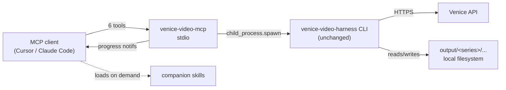

# venice-video-mcp

A token-lean **MCP server** for the [venice-video-harness](https://github.com/jordanurbs/venice-video-harness): consistency-first AI video creation through Venice — series, branded content, narrative, or any multi-shot workflow.

The server exposes **6 verb tools** (~600 always-loaded tokens) instead of 20+ granular ones. Workflow knowledge lives in **3 companion skills** that the agent loads on demand.

---

## What this is

The harness is a complete TypeScript CLI for driving Venice's video, image, and audio APIs with character consistency, multi-shot planning, vision-based QA, and ffmpeg assembly. This MCP server is a **thin adapter** that lets MCP-aware clients (Cursor, Claude Code, Claude Desktop) drive that pipeline through natural-language tool calls.

The MCP server **shells out to the harness CLI** — zero coupling, no code duplication. Pull the harness, build it, point the MCP at it, and you're done.



## Tool surface

| Tool | Actions | Long-running? |
|---|---|---|
| `series` | `new`, `list`, `set_aesthetic`, `explore_aesthetic` | no |
| `character` | `add`, `audition_voices`, `lock` | sometimes |
| `episode` | `new`, `workshop`, `approve`, `storyboard`, `qa`, `qa_approve`, `fix_panel` | sometimes |
| `media` | `generate_videos`, `override_audio`, `generate_music`, `validate` | **yes** (progress) |
| `assemble` | `assemble`, `produce`, `edit_transcribe`, `edit_render`, `edit_timeline` | **yes** (progress) |
| `inspect` | `list`, `series`, `episode`, `shot`, `models`, `voices` | no |

For exact per-action arguments see `skills/venice-mcp-cookbook/SKILL.md`.

## Companion skills

Three Markdown skills are shipped under `skills/`:

- **`venice-mcp-pipeline`** — natural-language → tool-call recipes for the common end-to-end workflows.
- **`venice-mcp-cookbook`** — every action with copy-paste argument examples.
- **`venice-mcp-troubleshooting`** — every known production gotcha (wrong aspect ratio, character drift, Seedance provenance, filler-trim rules) with cause + fix.

Skills load on demand — they cost zero tokens until the agent decides it needs them.

---

## Installation

### 1. Install and build the harness

The MCP shells out to the harness, so you need it built and available.

```bash
git clone https://github.com/jordanurbs/venice-video-harness.git
cd venice-video-harness
npm install
npm run build
npm link            # exposes `venice-video` on PATH
```

Verify:
```bash
venice-video --help
```

### 2. Install and build the MCP server

```bash
git clone https://github.com/jordanurbs/venice-video-mcp.git
cd venice-video-mcp
npm install
npm run build
```

### 3. Install the companion skills

Pick one (or both):

```bash
# Workspace-only (current project's .claude/skills/)
node bin/install-skills.js --workspace ./

# Global (~/.claude/skills/, available in any project)
node bin/install-skills.js --global

# Both
node bin/install-skills.js --workspace ./ --global
```

The installer creates symlinks into the target — running it again is idempotent. Use `--uninstall` to remove the symlinks (the source skills are untouched).

### 4. Configure your MCP client

#### Cursor (`.cursor/mcp.json`)

See `examples/cursor.mcp.json`. Copy into your repo and adjust the absolute paths:

```json
{
  "mcpServers": {
    "venice-video": {
      "command": "node",
      "args": ["/ABS/PATH/TO/venice-video-mcp/bin/venice-video-mcp.js"],
      "env": {
        "VENICE_API_KEY": "vn_...",
        "HARNESS_PATH": "/ABS/PATH/TO/venice-video-harness",
        "HARNESS_WORKSPACE": "/ABS/PATH/TO/venice-video-harness"
      }
    }
  }
}
```

#### Claude Desktop

Same shape, written into `~/Library/Application Support/Claude/claude_desktop_config.json` (macOS) or the equivalent on other OSes. See `examples/claude-desktop.config.json`.

#### Claude Code (CLI)

```bash
claude mcp add venice-video -- node /ABS/PATH/TO/venice-video-mcp/bin/venice-video-mcp.js
# then set env via shell or claude_code config
```

---

## Configuration

The MCP server reads these environment variables:

| Variable | Required | Purpose |
|---|---|---|
| `VENICE_API_KEY` | yes | Venice API auth (forwarded to the harness) |
| `HARNESS_PATH` | recommended | Absolute path to the harness repo (with built `dist/`) |
| `HARNESS_BIN` | optional | Explicit path to a built harness CLI (`dist/mini-drama/cli.js`) |
| `HARNESS_WORKSPACE` | optional | Where the MCP looks for series; defaults to cwd. Resolves project slugs against `<workspace>/output/<slug>/` |

Resolution order for the harness binary:
1. `HARNESS_BIN` if set and exists.
2. `venice-video` on PATH (i.e. you ran `npm link` in the harness).
3. `HARNESS_PATH/dist/mini-drama/cli.js` if `HARNESS_PATH` is set.

### Where your video projects land

`HARNESS_WORKSPACE` should be a **dedicated directory you own** (e.g. `~/venice-projects/`), **not** the harness repo. All series materialize under `<HARNESS_WORKSPACE>/output/<slug>/` — the `output/` segment is hardcoded by the harness, so `HARNESS_WORKSPACE` controls the *parent* of `output/`, not its replacement. Pre-create the directory; the server refuses to start if it doesn't exist. If `HARNESS_WORKSPACE` is unset, the server falls back to `process.cwd()`, which is rarely what you want for GUI-launched MCP clients.

`ffmpeg` and `ffprobe` must be on PATH (used by `assemble.assemble`, `produce`, `edit_render`, `edit_timeline`).

---

## Usage

Once configured, talk to your MCP client in natural language. The agent reads the `venice-mcp-pipeline` skill on demand to map your request to tool calls.

> "List my Venice series."
>
> Calls `inspect { action: 'list' }`. Returns the series catalog from `<workspace>/output/`.

> "Make a new series called 'The Audacity' about a sarcastic talk-show host."
>
> Calls `series { action: 'new', name: 'The Audacity', concept: '…' }`, then prompts you for aesthetic.

> "Produce episode 1 of the-audacity."
>
> Calls `assemble { action: 'produce', project: 'the-audacity', episode: 1 }` with progress notifications streaming during the long render.

For more recipes see `skills/venice-mcp-pipeline/SKILL.md`.

---

## Architecture

```text
venice-video-mcp/
├── bin/
│   ├── venice-video-mcp.js        # stdio entry shim (built dist)
│   └── install-skills.js          # skill installer shim
├── src/
│   ├── server.ts                  # registers 6 tools, stdio transport
│   ├── config.ts                  # HARNESS_BIN / HARNESS_PATH resolution
│   ├── harness.ts                 # spawn wrapper, stdout streaming
│   ├── progress.ts                # parses harness stdout → MCP progress
│   ├── schemas.ts                 # zod discriminated unions + flat shapes
│   ├── responses.ts               # { ok, paths, message } helpers
│   └── tools/
│       ├── series.ts
│       ├── character.ts
│       ├── episode.ts
│       ├── media.ts
│       ├── assemble.ts            # also wraps the harness's edit-pipeline scripts
│       └── inspect.ts             # reads JSON state directly (no spawn)
├── skills/
│   ├── venice-mcp-pipeline/SKILL.md
│   ├── venice-mcp-cookbook/SKILL.md
│   └── venice-mcp-troubleshooting/SKILL.md
├── scripts/
│   └── install-skills.ts          # workspace + global symlink installer
└── examples/
    ├── cursor.mcp.json
    └── claude-desktop.config.json
```

### Why a single-file-per-tool, action-discriminated design?

- **Token frugality.** Six tools with one-line descriptions cost ~600 tokens vs ~3K for granular per-command tools. Skills carry the rest of the knowledge on demand.
- **Schema correctness.** Each tool's input is a flat `z.object` with action enum + optional fields, so MCP clients see real JSON Schema (not empty objects). Internal validation runs through zod discriminated unions for full type safety.
- **No coupling to harness internals.** Adding a new harness CLI command? Add a `case` in the right tool, an action to the schema, and a cookbook example. No SDK refactor, no harness changes.

### Why shell out instead of importing harness modules?

- The harness is a normal CLI app, not a library. Re-exposing every internal function as a public API would be a meaningful breaking change.
- Spawning means the MCP picks up harness fixes automatically (`git pull` in the harness repo, that's it).
- Per-call overhead is ~50ms — negligible against multi-minute Venice generation calls.

---

## Development

```bash
npm run dev          # tsx watch mode against src/server.ts
npm run build        # tsc → dist/
npm test             # (TODO)
```

Manual smoke test of the stdio protocol:

```bash
cat <<'EOF' | HARNESS_PATH=/abs/harness HARNESS_WORKSPACE=/abs/harness node bin/venice-video-mcp.js | python3 -m json.tool
{"jsonrpc":"2.0","id":1,"method":"initialize","params":{"protocolVersion":"2024-11-05","capabilities":{},"clientInfo":{"name":"smoke","version":"0"}}}
{"jsonrpc":"2.0","method":"notifications/initialized"}
{"jsonrpc":"2.0","id":2,"method":"tools/list"}
{"jsonrpc":"2.0","id":3,"method":"tools/call","params":{"name":"inspect","arguments":{"action":"list"}}}
EOF
```

---

## License

MIT. See [LICENSE](LICENSE).

## See also

- **The harness:** [venice-video-harness](https://github.com/jordanurbs/venice-video-harness)
- **MCP spec:** [modelcontextprotocol.io](https://modelcontextprotocol.io)
- **Venice API:** [venice.ai](https://venice.ai)
