# venice-mcp-pipeline

This skill is the workflow brain for the **venice-video-mcp** server. It tells you which of the six tools to call, in what order, for the most common requests.

## The 6 tools (always-loaded surface)

| Tool | Actions | Long-running? |
|---|---|---|
| `series` | `new`, `list`, `set_aesthetic`, `explore_aesthetic` | no |
| `character` | `add`, `audition_voices`, `lock` | sometimes (image gen) |
| `episode` | `new`, `workshop`, `approve`, `storyboard`, `qa`, `qa_approve`, `fix_panel`, `insert_shot` | sometimes (storyboard, qa) |
| `media` | `generate_videos`, `override_audio`, `generate_music`, `generate_ambient`, `validate` | **yes** |
| `assemble` | `assemble`, `produce`, `mix_audio`, `edit_transcribe`, `edit_render`, `edit_timeline`, `export_timeline` | **yes** (except `export_timeline`, which is cheap XML write) |
| `inspect` | `list`, `series`, `episode`, `shot`, `models`, `voices` | no |

For full per-action argument shapes see the **venice-mcp-cookbook** skill.
For failures, gotchas, and anti-patterns see **venice-mcp-troubleshooting**.

## What the underlying harness now does for you (v2.1.x)

Several behaviours the MCP relied on the agent to orchestrate are now automatic inside the harness. You don't have to script them — but you should know they're running so you can interpret stdout:

- **Seedance scene-level multi-shot.** When adjacent shots share the same characters and location, the harness now plans them as a single Seedance multi-shot generation by default. You won't see "shot 5 of 12" — you'll see "unit 3 of 8 (covers shots 5-6)". This is fine; identity stays anchored across the unit.
- **Motion-classified video routing.** Each shot's `motion` field (`low | medium | high`) drives the planner. Low/medium-motion dialogue shots with a visible face route to `wan-2-7-image-to-video` for lip-sync; high-motion or face-occluded shots stay on the R2V model. `episode.insert_shot` lets you set `motion` directly. To change motion on an existing shot, edit `script.json`.
- **Per-act music cues with crossfade.** If the episode script has a `musicCues[]` array (manually authored or via `episode.workshop` for series that opt in), `assemble.assemble` / `produce` will render and crossfade them automatically. The single-bed `media.generate_music` path still works — when both exist, the cues win.
- **LUFS audio mix.** The assembler now runs a final-pass to -16 LUFS integrated / -1 dBTP true peak by default. SFX clips are trimmed to ≤2s with a 0.3s fade-out. Episode-level overrides go in `script.audioMix`.
- **Wan 2.7 audio pre-flight.** When a shot's `audioUrl` is shorter than 3 seconds, the harness pads it to 3s automatically (Wan 2.7 returns 400 otherwise). You'll see a "padded audio_url N.NNs -> 3.00s" line in stdout.
- **Silent-rejection guard.** Every Venice response is checked for the "no output produced" pattern that occasionally slips past a 200 OK. The harness retries up to 3 times and surfaces a structured error instead of returning a zero-byte file.

## Mental model

```mermaid
flowchart LR
    A[series.new] --> B[series.set_aesthetic]
    B --> C[character.add]
    C --> D[character.audition_voices]
    D --> E[character.lock]
    E --> F[episode.new]
    F --> G[episode.workshop]
    G --> H[episode.approve]
    H --> I[episode.storyboard]
    I --> J[episode.qa]
    J -->|good| K[episode.qa_approve]
    J -->|bad shot| L[episode.fix_panel]
    L --> J
    K --> M[media.generate_videos]
    M --> N[media.generate_music]
    N --> O[assemble.assemble]
    O --> P[final mp4]
```

The MCP shells out to the Venice Video Harness CLI. State lives on the local filesystem under the workspace's `output/<series-slug>/` directory. You're orchestrating a multi-stage creative pipeline:

`assemble.produce` is a one-shot path that runs `media.generate_videos` -> `media.generate_music` -> `assemble.assemble` in sequence. Use `produce` only when the user explicitly says "do everything," and never before QA approval.

## Recipes

### Recipe 1: New series from scratch
The user says: "Make a new series about X."

1. `series.new { name, concept, genre?, setting? }` --- creates the series directory.
2. `series.set_aesthetic { project, style, palette, lighting, lens?, film? }` --- locks the visual rule. Required before any image generation.
3. (Optional) `series.explore_aesthetic { project, count: 5 }` --- only if the user is undecided about aesthetic direction.

Stop here. Confirm with the user before adding characters.

### Recipe 2: Add and lock a character
The user says: "Add character Vivienne to the series."

1. `character.add { project, name, gender, age?, description?, wardrobe?, voiceDesc?, baseTraits?, skipImages? }`
   - This generates 4-angle reference images by default (front, profile, three-quarter, full-body).
   - For non-human characters set `baseTraits` (see venice-mcp-cookbook example).
2. `character.audition_voices { project, character, count: 5, sampleText? }` --- generates Venice TTS samples.
3. After the user picks a voice: `character.lock { project, character, voiceId, voiceName? }`.

A character must be added AND locked before generating an episode that uses them.

### Recipe 3: Workshop, storyboard, QA, generate
The user says: "Make episode 3 about Y."

1. `episode.new { project, title }` --- scaffolds the episode dir + empty script.json.
2. `episode.workshop { project, episode, concept, model? }` --- LLM-drafts a shot-by-shot script.
3. Stop and let the user review/edit `script.json` directly. Then:
4. `episode.approve { project, episode, notes? }`.
5. `episode.storyboard { project, episode, refine: true, editModel?, force? }` --- generates panels (slow, supports progress notifications).
6. `episode.qa { project, episode, model?, shots? }` --- vision-based consistency check.
7. For each flagged shot: `episode.fix_panel { project, episode, shot, characters?, prompt? }`. Re-run QA after.
8. `episode.qa_approve { project, episode, notes? }`.
9. `media.generate_videos { project, episode }` --- LONG. Stream progress.
10. (Optional) `media.generate_music { project, episode, prompt?, duration? }` --- only needed if the script has no `musicCues[]`; per-act cues render automatically during assembly.
11. `assemble.assemble { project, episode, ... }` --- final mp4 with subtitles + music + ambient bed, mixed to -16 LUFS.

If the user said "just produce it from approved script" jump from step 8 to `assemble.produce` instead of running 9-11 separately.

### Recipe 3b: Add a beat to an already-rendered episode
The user says: "Insert a reaction shot after shot 5 of episode 3."

1. `episode.insert_shot { project, episode, after: "5", description, shotType?, duration?, motion?, characters?, dialogue?, speaker?, transition? }` --- assigns a suffix id like `5b` so existing shot numbers (and their already-rendered panels/clips) stay stable.
2. `episode.storyboard { project, episode, force: false }` --- only the new shot's panel is generated; existing panels are left in place.
3. `episode.qa { project, episode, shots: "5b" }` then `episode.qa_approve` after fixes.
4. `media.generate_videos { project, episode }` --- generates the missing clip only; existing clips are kept.
5. `assemble.assemble { project, episode, ... }` --- re-stitches with the new shot in place.

### Recipe 4: Generate ambient beds + run the script-aware mixer
The user says: "Add a rain bed to episode 2 and re-mix it." or "Mix this episode with ambient layering instead of the basic assembler."

Ambient beds and the script-aware mixer are an alternative to the plain `assemble.assemble` path:

1. Confirm via `inspect.episode { project, episode }` that the episode is QA-approved and `media.generate_videos` has produced clips. Inspect also reports the `ambientLayers[]` already on disk.
2. For each layer you want, call `media.generate_ambient { project, episode, layer, prompt, duration? }`. Pick `layer` from `rain-heavy | rain | crowd | quiet-night`; the filename / discovery layer is fixed to those four.
3. (Optional) `media.generate_music { project, episode, prompt?, duration? }` — or rely on `script.musicCues[]` if defined.
4. `assemble.mix_audio { project, episode }` — script-aware per-shot mix. Writes `episode-NNN-final-nosubs.mp4` then burns subtitles to `episode-NNN-final.mp4` if `subtitles.srt` exists. This **replaces** `assemble.assemble` for the episode (same output filename).

Use `assemble.assemble` for the simple, deterministic path; use `assemble.mix_audio` when you've authored ambient beds and want the harness to vary the mix per shot (e.g. dialogue shots get less ambient, action shots get more, fades at scene boundaries).

### Recipe 5: Hand off to a non-linear editor (FCP X / Premiere / DaVinci)
The user says: "Open episode 2 in [Resolve | Premiere | Final Cut]."

After `media.generate_videos` has produced clips:

1. `assemble.export_timeline { project, episode, format: 'fcpxml' | 'premiere' | 'davinci', fps?, width?, height? }`
2. Tell the user the output path. The extension makes the target editor unambiguous:
   - `fcpxml`   → `episode-NNN.fcpxml`         (Final Cut Pro X — File ▸ Import ▸ XML…)
   - `premiere` → `episode-NNN.premiere.xml`   (Premiere Pro — File ▸ Import…)
   - `davinci`  → `episode-NNN.resolve.fcpxml` (DaVinci Resolve — File ▸ Import ▸ Timeline…)
3. You can export multiple formats from the same episode — they coexist on disk because of the format-specific extensions.

### Recipe 4: Edit existing footage (no Venice generation)
The user says: "Cut down this footage / trim filler words / re-cut this episode."

This path does NOT use the harness's series/episode model. It operates on raw media files.

1. `assemble.edit_transcribe { dir, out, model?, language?, alignedFrom? }` --- writes `takes_packed.md` (text transcript, the primary editing surface) and per-source `*.words.json` files.
2. **READ the takes_packed.md and propose a cut strategy in plain text. STOP and wait for user confirmation.** Never render without approval (anti-pattern A15 in troubleshooting).
3. The actual EDL build + ffmpeg cut is outside the MCP surface today --- the agent invokes the harness's editing library directly via tsx (see `.claude/commands/edit-footage.md` in the harness for the playbook).
4. After the cut lands: `assemble.edit_render { manifest, font?, skipArchive?, dryRun? }` --- composites overlays from a manifest JSON.
5. `assemble.edit_timeline { video, start, end, out, ... }` --- generates a single PNG (filmstrip + waveform + word labels) for visual decisions during cut review.

**Read .claude/skills/video-editing/SKILL.md and .claude/commands/edit-footage.md from the harness repo before driving an edit.** They define the EDL format, the ask-confirm-execute-self-eval loop, and the filler-word handling rules.

## State discovery

When you need to know what exists before acting, use `inspect`:
- `inspect { action: 'list' }` --- enumerate all series in the workspace
- `inspect { action: 'series', project }` --- read series.json (aesthetic, characters, episode list, `videoDefaults` incl. `lipSyncModel` / `seedanceCompatibility` / `imageDefaults`, `storyboardAspectRatio`)
- `inspect { action: 'episode', project, episode }` --- script versions, approval state, final video path, shot count, `musicCueCount`, `audioMix` flag, `ambientLayers[]` (rain-heavy / rain / crowd / quiet-night on disk), `hasMusic`, `timelineExports[]` (FCPXML/Premiere/DaVinci files on disk)
- `inspect { action: 'shot', project, episode, shot }` --- list shot-NNN.* files
- `inspect { action: 'models', category? }` --- model registry from the harness (includes the v2.1 additions: Wan 2.7, Kling O3 4K, HappyHorse 1.0, GPT Image 2)
- `inspect { action: 'voices', provider? }` --- TTS voice catalog

`inspect` is cheap (no spawn). Call it freely before mutating tools.

## Long-running operations and progress

`media.generate_videos`, `media.generate_music`, `assemble.assemble`, `assemble.produce`, and `assemble.edit_render` can take many minutes. The MCP server emits `notifications/progress` for each. If you set a `progressToken` in the request `_meta`, you'll receive unit/shot N-of-M, ffmpeg time codes, and queue/poll status updates.

Heads-up on stdout patterns the harness emits in v2.1.x that you should NOT mistake for failures:

- `unit X of Y (covers shots A-B)` — scene-level multi-shot generation; one Venice call covers multiple consecutive shots.
- `padded audio_url N.NNs -> 3.00s` — Wan 2.7 audio pre-flight padded a short clip.
- `routing shot N to wan-2-7-image-to-video` — motion classifier picked the lip-sync model for that shot.
- `LUFS final pass: integrated -X.X / true-peak -Y.Y` — assembler is normalising to -16 LUFS.

Don't poll `inspect` during a long-running call --- you already get progress notifications.

## When to use `produce` vs explicit steps

Prefer explicit steps unless the user is in "just do it all" mode. Explicit gives you:
- A QA gate before video generation (which is the most expensive step).
- The chance to override audio (`media.override_audio { dialogue: true }`) for character voice consistency.
- Per-step progress that you can summarize for the user.

Use `assemble.produce { withTts?, skipMusic? }` only when:
- The script is already approved.
- The QA pass has already happened (or the user explicitly says "skip QA").
- The user is fine with all defaults.

## Conventions you must follow

1. **Always confirm before destructive operations.** `episode.storyboard --force` regenerates ALL panels. `episode.fix_panel` versions the prior panel automatically (archive-first --- never just overwrites).
2. **Never group shots with different characters** into multi-shot units. The harness handles this internally; if you ever bypass it, you'll lose R2V identity anchoring. (See troubleshooting A1.)
3. **Set the workspace explicitly** if your project lives outside the cwd. The MCP resolves `project: "the-audacity"` against `$HARNESS_WORKSPACE/output/the-audacity/` first.
4. **Never auto-trim filler words without confirmation** in edits. (See troubleshooting A16.)
5. **Read the cookbook** for exact arg names. The flat input schemas use action-keyed optional fields, so the cookbook examples are the source of truth for which fields belong to which action.
