# venice-mcp-pipeline

This skill is the workflow brain for the **venice-video-mcp** server. It tells you which of the six tools to call, in what order, for the most common requests.

## The 6 tools (always-loaded surface)

| Tool | Actions | Long-running? |
|---|---|---|
| `series` | `new`, `list`, `set_aesthetic`, `explore_aesthetic` | no |
| `character` | `add`, `audition_voices`, `lock` | sometimes (image gen) |
| `episode` | `new`, `workshop`, `approve`, `storyboard`, `qa`, `qa_approve`, `fix_panel` | sometimes (storyboard, qa) |
| `media` | `generate_videos`, `override_audio`, `generate_music`, `validate` | **yes** |
| `assemble` | `assemble`, `produce`, `edit_transcribe`, `edit_render`, `edit_timeline` | **yes** |
| `inspect` | `list`, `series`, `episode`, `shot`, `models`, `voices` | no |

For full per-action argument shapes see the **venice-mcp-cookbook** skill.
For failures, gotchas, and anti-patterns see **venice-mcp-troubleshooting**.

## Mental model

```mermaid
flowchart LR
    A[series.new] --> B[series.set_aesthetic]
    B --> C[character.add]
    C --> D[character.audition_voices]
    D --> E[character.lock]
    E --> F[episode.new]
    F --> G[episode.workshop]
    G --> H[episode.approve]
    H --> I[episode.storyboard]
    I --> J[episode.qa]
    J -->|good| K[episode.qa_approve]
    J -->|bad shot| L[episode.fix_panel]
    L --> J
    K --> M[media.generate_videos]
    M --> N[media.generate_music]
    N --> O[assemble.assemble]
    O --> P[final mp4]
```

The MCP shells out to the Venice Video Harness CLI. State lives on the local filesystem under the workspace's `output/<series-slug>/` directory. You're orchestrating a multi-stage creative pipeline:

`assemble.produce` is a one-shot path that runs `media.generate_videos` -> `media.generate_music` -> `assemble.assemble` in sequence. Use `produce` only when the user explicitly says "do everything," and never before QA approval.

## Recipes

### Recipe 1: New series from scratch
The user says: "Make a new series about X."

1. `series.new { name, concept, genre?, setting? }` --- creates the series directory.
2. `series.set_aesthetic { project, style, palette, lighting, lens?, film? }` --- locks the visual rule. Required before any image generation.
3. (Optional) `series.explore_aesthetic { project, count: 5 }` --- only if the user is undecided about aesthetic direction.

Stop here. Confirm with the user before adding characters.

### Recipe 2: Add and lock a character
The user says: "Add character Vivienne to the series."

1. `character.add { project, name, gender, age?, description?, wardrobe?, voiceDesc?, baseTraits?, skipImages? }`
   - This generates 4-angle reference images by default (front, profile, three-quarter, full-body).
   - For non-human characters set `baseTraits` (see venice-mcp-cookbook example).
2. `character.audition_voices { project, character, count: 5, sampleText? }` --- generates Venice TTS samples.
3. After the user picks a voice: `character.lock { project, character, voiceId, voiceName? }`.

A character must be added AND locked before generating an episode that uses them.

### Recipe 3: Workshop, storyboard, QA, generate
The user says: "Make episode 3 about Y."

1. `episode.new { project, title }` --- scaffolds the episode dir + empty script.json.
2. `episode.workshop { project, episode, concept, model? }` --- LLM-drafts a shot-by-shot script.
3. Stop and let the user review/edit `script.json` directly. Then:
4. `episode.approve { project, episode, notes? }`.
5. `episode.storyboard { project, episode, refine: true, editModel?, force? }` --- generates panels (slow, supports progress notifications).
6. `episode.qa { project, episode, model?, shots? }` --- vision-based consistency check.
7. For each flagged shot: `episode.fix_panel { project, episode, shot, characters?, prompt? }`. Re-run QA after.
8. `episode.qa_approve { project, episode, notes? }`.
9. `media.generate_videos { project, episode }` --- LONG. Stream progress.
10. (Optional) `media.generate_music { project, episode, prompt?, duration? }`.
11. `assemble.assemble { project, episode, ... }` --- final mp4 with subtitles + music + ambient bed.

If the user said "just produce it from approved script" jump from step 8 to `assemble.produce` instead of running 9-11 separately.

### Recipe 4: Edit existing footage (no Venice generation)
The user says: "Cut down this footage / trim filler words / re-cut this episode."

This path does NOT use the harness's series/episode model. It operates on raw media files.

1. `assemble.edit_transcribe { dir, out, model?, language?, alignedFrom? }` --- writes `takes_packed.md` (text transcript, the primary editing surface) and per-source `*.words.json` files.
2. **READ the takes_packed.md and propose a cut strategy in plain text. STOP and wait for user confirmation.** Never render without approval (anti-pattern A15 in troubleshooting).
3. The actual EDL build + ffmpeg cut is outside the MCP surface today --- the agent invokes the harness's editing library directly via tsx (see `.claude/commands/edit-footage.md` in the harness for the playbook).
4. After the cut lands: `assemble.edit_render { manifest, font?, skipArchive?, dryRun? }` --- composites overlays from a manifest JSON.
5. `assemble.edit_timeline { video, start, end, out, ... }` --- generates a single PNG (filmstrip + waveform + word labels) for visual decisions during cut review.

**Read .claude/skills/video-editing/SKILL.md and .claude/commands/edit-footage.md from the harness repo before driving an edit.** They define the EDL format, the ask-confirm-execute-self-eval loop, and the filler-word handling rules.

## State discovery

When you need to know what exists before acting, use `inspect`:
- `inspect { action: 'list' }` --- enumerate all series in the workspace
- `inspect { action: 'series', project }` --- read series.json (aesthetic, characters, episode list)
- `inspect { action: 'episode', project, episode }` --- script versions, approval state, final video path, shot count
- `inspect { action: 'shot', project, episode, shot }` --- list shot-NNN.* files
- `inspect { action: 'models', category? }` --- model registry from the harness
- `inspect { action: 'voices', provider? }` --- TTS voice catalog

`inspect` is cheap (no spawn). Call it freely before mutating tools.

## Long-running operations and progress

`media.generate_videos`, `media.generate_music`, `assemble.assemble`, `assemble.produce`, and `assemble.edit_render` can take many minutes. The MCP server emits `notifications/progress` for each. If you set a `progressToken` in the request `_meta`, you'll receive shot-N-of-M, ffmpeg time codes, and queue/poll status updates.

Don't poll `inspect` during a long-running call --- you already get progress notifications.

## When to use `produce` vs explicit steps

Prefer explicit steps unless the user is in "just do it all" mode. Explicit gives you:
- A QA gate before video generation (which is the most expensive step).
- The chance to override audio (`media.override_audio { dialogue: true }`) for character voice consistency.
- Per-step progress that you can summarize for the user.

Use `assemble.produce { withTts?, skipMusic? }` only when:
- The script is already approved.
- The QA pass has already happened (or the user explicitly says "skip QA").
- The user is fine with all defaults.

## Conventions you must follow

1. **Always confirm before destructive operations.** `episode.storyboard --force` regenerates ALL panels. `episode.fix_panel` versions the prior panel automatically (archive-first --- never just overwrites).
2. **Never group shots with different characters** into multi-shot units. The harness handles this internally; if you ever bypass it, you'll lose R2V identity anchoring. (See troubleshooting A1.)
3. **Set the workspace explicitly** if your project lives outside the cwd. The MCP resolves `project: "the-audacity"` against `$HARNESS_WORKSPACE/output/the-audacity/` first.
4. **Never auto-trim filler words without confirmation** in edits. (See troubleshooting A16.)
5. **Read the cookbook** for exact arg names. The flat input schemas use action-keyed optional fields, so the cookbook examples are the source of truth for which fields belong to which action.
